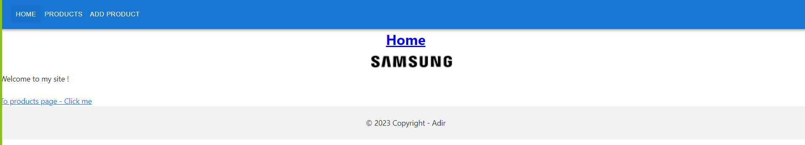
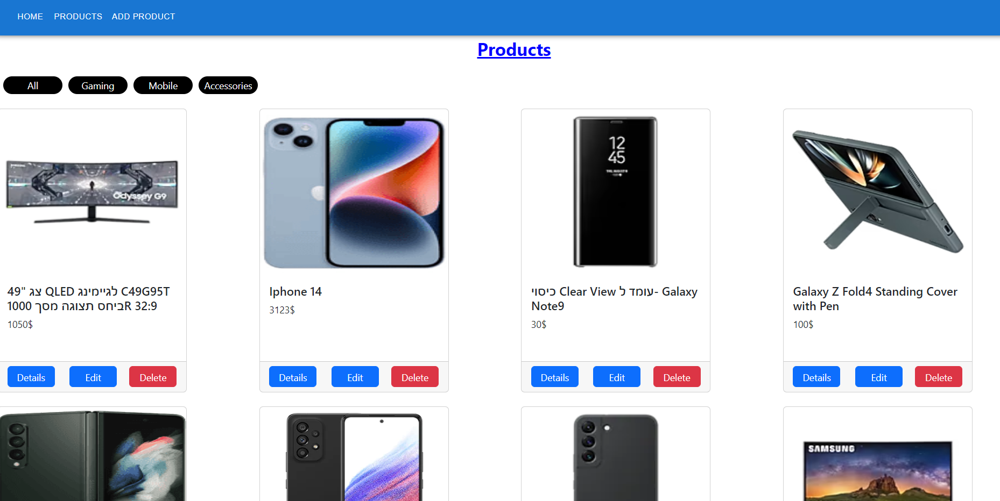
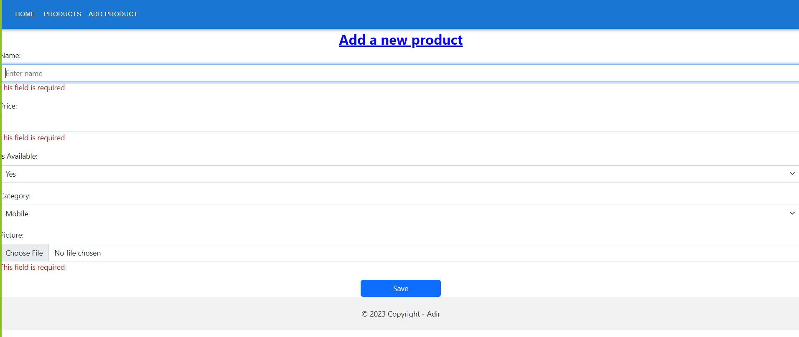
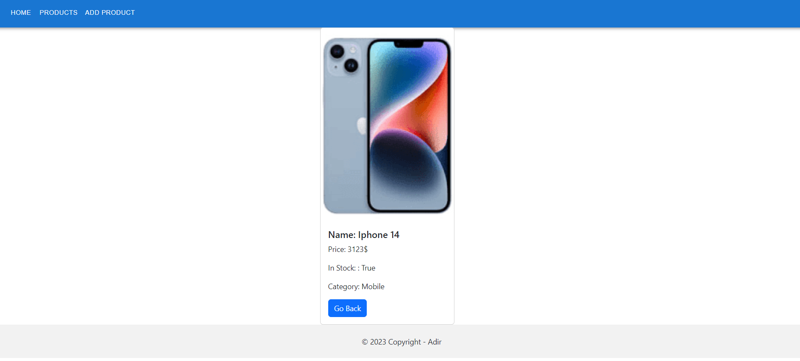
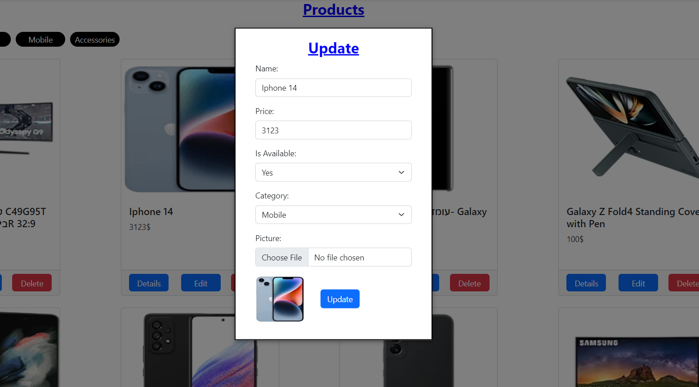
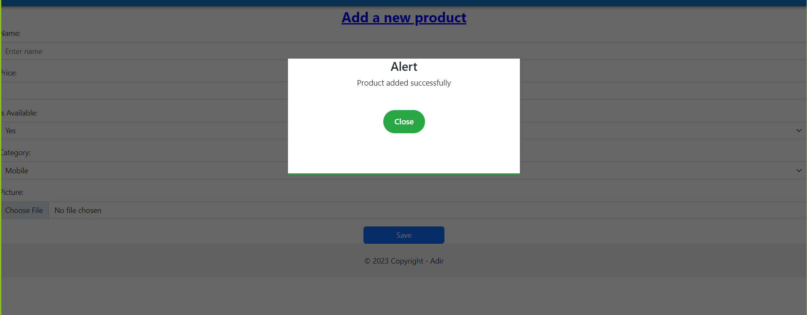

החברה מחויבת לציית לחוקים ולתקנות המקומיים, וגם ליישומו של קוד התנהגות גלובלי מחמיר שחל על כל העובדים. החברה מאמינה כי ניהול אתי אינו רק כלי לתגובה לשינויים מהירים בסביבה העסקית הגלובלית, אלא גם כלי לבניית אמון מול בעלי העניין השונים שלה, כולל לקוחות, בעלי מניות, עובדים, שותפים עסקיים וקהילות מקומיות. מתוך כוונה להפוך לאחת מהחברות האתיות ביותר בעולם, החברה ממשיכה להדריך את העובדים שלה ולהפעיל מערכות ניטור, תוך שמירה על ניהול תאגידי הוגן ושקוף.

דף הבית:

דף מוצרים:

דף הוספת מוצר חדש:

דף הצגת פרטים עבור מוצר:

דף עריכת פרטים עבור מוצר:

התראות:

